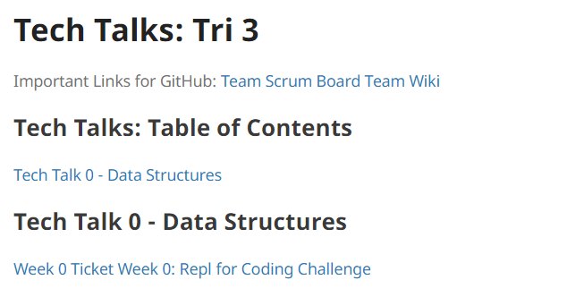
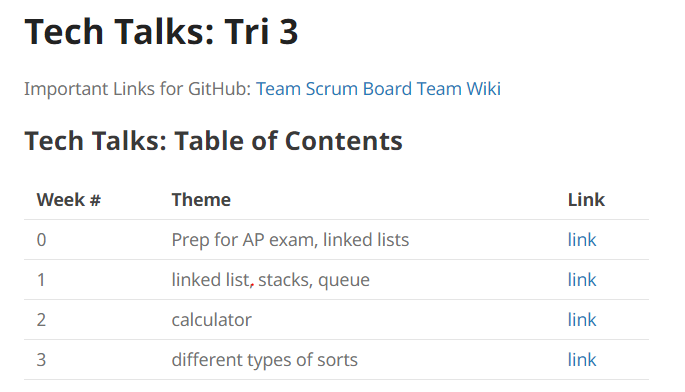
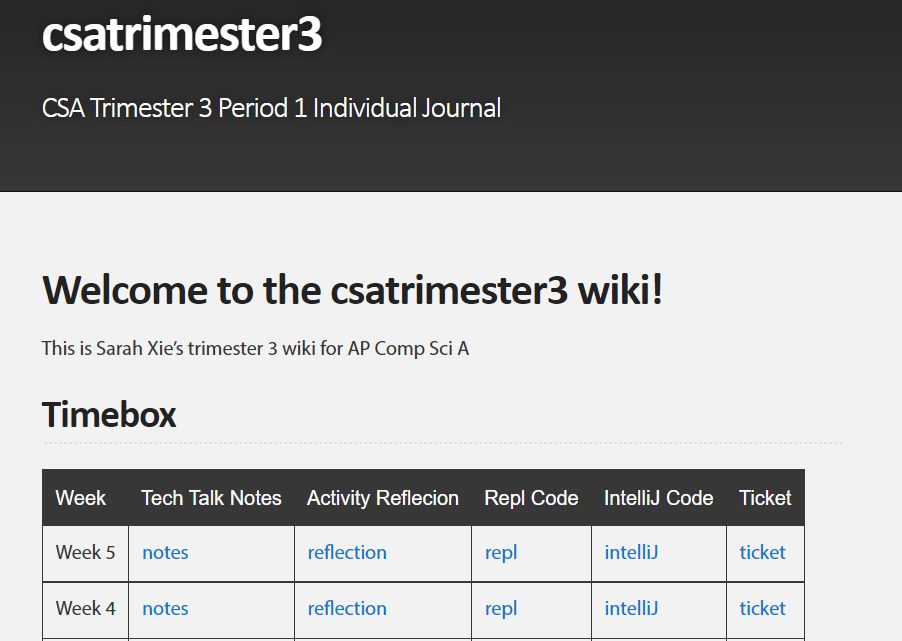
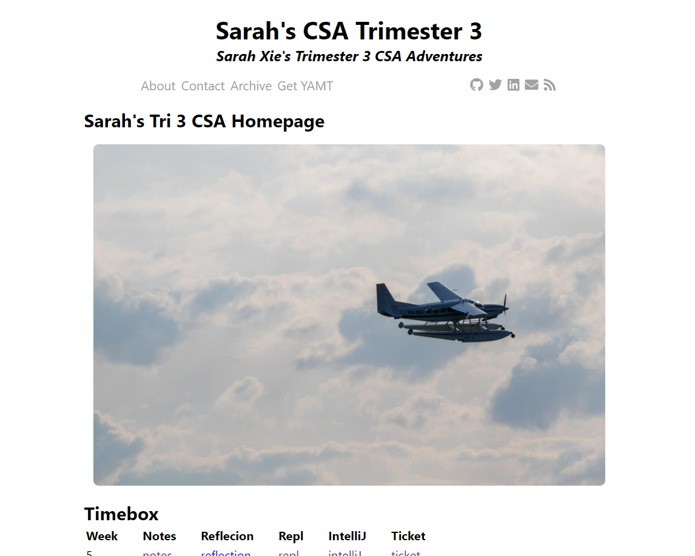

# Week 4 Review

This week was crossover editing, so I edited Natasha's repository. Her repository was overall really good, and her coding and organization was really strong.

Here are some things I noticed in her repository:
* tech talks are easy to access
* Code is a bit messy, hard to read
* Sometimes the formatting is incorrect
* The table of contents doesn't have all the of the info

While working in her repository, I did the following:
* Clean up the code: add comments, correct the indentation, and make the white space consistent
* Added an actual table for the table of contents, and updated it with the correct information

Here's how the table looked before I edited it:

Now, it looks like this:

I also changed my own theme to look better. Here's how it looked in the past:

Now, it looks like this:

